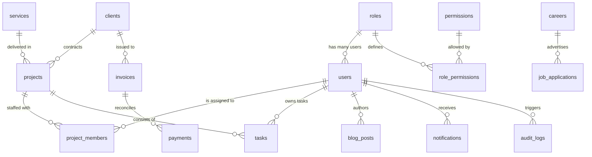

# NEXORA TECH - Entity Relationship Diagram & Table Relationships

This document outlines the detailed relational mappings, foreign key behaviors, cascading properties, unique constraints, and architectural layout for Nexora Tech's enterprise-grade PostgreSQL database.

---

## 1. System ER Diagram (Mermaid Representation)

---

## 2. Table Detail & Relational Matrix

| Sequence | Table Name | Cardinality / Relationships | Active Constraints | Cascade Configuration |
| :--- | :--- | :--- | :--- | :--- |
| **1** | `roles` | `1:N` to `users`, `1:N` to `role_permissions` | `id` PK, `name` UNIQUE | Restrict on users, cascade on permissions |
| **2** | `permissions` | `1:N` to `role_permissions` | `id` PK, `permissionName` UNIQUE | Cascade on join table associations |
| **3** | `role_permissions` | Bridge Table for Roles <-> Permissions | Composite PK `[roleId, permissionId]` | Cascade delete on both dimensions |
| **4** | `users` | `1:N` from `roles`, `1:N` to `project_members`, `assignedTasks`, `blogPosts`, `notifications`, `auditLogs` | `id` PK, `email` UNIQUE | Restrict on task/blog deletes; cascade notifications |
| **5** | `clients` | `1:N` to `projects`, `invoices` | `id` PK, `email` UNIQUE | Restrict on system projects, standard clients delete protection |
| **6** | `services` | `1:N` to `projects` | `id` PK, `serviceName` UNIQUE | Restrict (cannot delete service with active projects) |
| **7** | `projects` | `1:N` from `clients`, `1:N` from `services`, `1:N` to `project_members`, `tasks` | `id` PK | Cascade project members, tasks |
| **8** | `project_members`| Bridge Table for Projects <-> Users | Composite PK `[projectId, userId]` | Cascade on deletion of projects or users |
| **9** | `tasks` | `1:N` from `projects`, `1:N` from `users` (assigned) | `id` PK | Cascade on Project delete; restrict on User delete |
| **10**| `blog_posts` | `1:1` from `users` (author) | `id` PK, `slug` UNIQUE | Restrict (cannot delete author user with posts) |
| **11**| `testimonials` | Standalone client rating ledger | `id` PK, rating check limit [1..5] | Standalone Table |
| **12**| `contact_messages`| Public inquiries database ledger | `id` PK | Standalone Table |
| **13**| `careers` | `1:N` to `job_applications` | `id` PK | Cascade deletes on dependent applications |
| **14**| `job_applications`| `1:N` from `careers` | `id` PK | Cascade on parent career index deletion |
| **15**| `invoices` | `1:N` from `clients`, `1:N` to `payments` | `id` PK, `invoiceNumber` UNIQUE | Restrict (cannot delete client with active invoices) |
| **16**| `payments` | `1:N` from `invoices` | `id` PK, `transactionId` UNIQUE | Restrict (cannot delete invoice with logged payments) |
| **17**| `notifications` | `1:N` from `users` | `id` PK | Cascade on receiver user deletion |
| **18**| `audit_logs` | `1:N` from `users` (nullable) | `id` PK | Set Null on User delete (retains log history) |

---

## 3. High-Integrity Relational Rules

1. **Role-Based Access Control (RBAC) Integrity**: 
   Permissions are bounded to roles via the compiled bridge table `role_permissions`. This isolates role mapping cleanly from dynamic user profiles.
2. **Double Bridge Mapping**:
   Instead of string mapping, `project_members` keeps strong relational arrays of assignees matched dynamically via `projectId -> userId` composite keys.
3. **Audit Isolation**:
   When a user is deleted from the enterprise ledger, `audit_logs` are preserved with their `userId` set to `NULL`, preventing orphans while retaining operational transaction footprints.
4. **Financial Lock**:
   Invoices and Payments use `onDelete: Restrict` rules. This stops clients or administrators from accidentally deleting invoices that have transaction records or active payment sessions.
